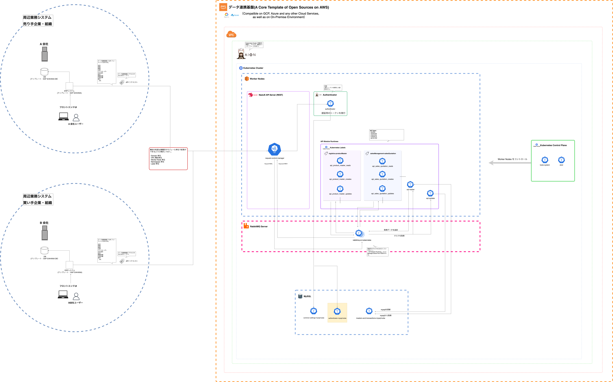

# data-platfrom-authenticator-mysql-kube
data-platfrom-authenticator-mysql-kube は、データ連携基盤において、ユーザー認証に必要なデータを保存するテーブルを維持管理するMySQLデータベースを、Kubernetes上で立ち上げ稼働させるための マイクロサービス です。    
本リポジトリには、必要なマニフェストファイル等が入っています。  

## 動作環境

* OS: Linux OS  
* CPU: ARM/AMD/Intel  
* Kubernetes  

## data-platfrom-authenticator-mysql-kube を用いたアーキテクチャ  
data-platfrom-authenticator-mysql-kube は、下記の黄色い枠の部分のリソースです。  
  
